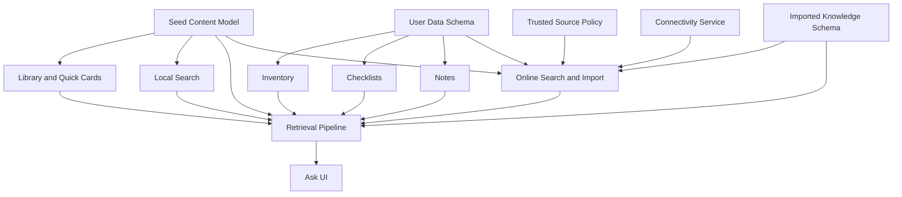

# MVP Scope And Roadmap

Status: Initial draft complete.  
Related docs: [PRD](./02-prd.md), [Information Architecture And UX Flows](./04-information-architecture-and-ux-flows.md), [Technical Architecture](./05-technical-architecture.md), [Quality Strategy](./11-quality-strategy-test-plan-and-acceptance.md), [Risk Register](./risk-register.md)

## Confirmed Facts

- The product must deliver meaningful offline value first.
- The first release must remain practical for a solo developer or very small team.
- Major user-facing features should continue working offline even if optional online enrichment is present.

## Assumptions

- The codebase started from a blank iOS app skeleton; the app shell and navigation are now in place (Milestone 1 Phase 1 complete).
- Seed content authoring and technical implementation will need to progress in parallel.
- v1 can ship without cloud backup, cross-device sync, or advanced mapping.

## Recommendations

- Sequence implementation so the local content model and retrieval path exist before Ask UI polishing.
- Keep online knowledge refresh limited to one narrow, trustworthy flow in MVP.
- Defer features that introduce remote accounts, collaboration, or heavy media complexity.

## Open Questions

- Should the first public release include any background refresh, or only manual import and refresh?
- Is offline map support a post-MVP feature?
- How much checklist and inventory sophistication is actually needed before launch?

## v1 MVP Scope

### Included

- native iPhone app shell
- Home, Library, Ask, Inventory, Checklists, Quick Cards, Notes, Settings
- curated seed handbook chapters in all initial domains
- offline local search across handbook and user data
- offline inventory CRUD
- offline checklist templates and checklist runs
- offline personal notes
- bounded Ask over local approved content and app data
- citations in Ask answers
- model capability fallback behavior
- at least one user-driven trusted-source import flow that stores knowledge locally for future offline use

### Excluded From MVP

- account system
- backup and sync
- collaboration
- offline map engine
- attachment-heavy note taking
- bundled fallback LLM
- broad multi-format ingestion beyond the first supported source formats

## v1.1 Enhancements

- curated developer-shipped remote content packs
- subscribed source refresh for previously approved sources
- richer inventory alerts such as expiring supplies and low-stock reminders
- improved Ask explanation quality and better result grouping
- optional export of notes, inventory, and checklist data
- widgets or app shortcuts for emergency quick cards

## Future Stretch Ideas

- explicit backup and sync
- household shared profiles
- offline map overlays and map note pinning
- richer import pipeline for PDFs or structured public documents
- advanced retrieval methods such as embeddings if justified
- Apple Watch or iPad companions

## What Is Deferred

- any feature that requires a backend to be useful
- advanced geospatial functionality
- generalized chat behavior
- broad media management
- multi-user workflows and permissions

## Implementation Sequencing

1. ~~Project skeleton, navigation shell, and design tokens.~~ **Done.**
2. ~~Persistence layer, seed-content import, and repository protocols.~~ **Done.**
3. ~~Handbook and quick-card browsing plus local search.~~ **Done.**
4. ~~Inventory, checklists, and notes.~~ **Done:** domain models, repository protocols, SwiftData persistence, CRUD UI, and FTS5 search index implemented.
5. ~~Retrieval pipeline and Ask with extractive fallback.~~ **Done:** retrieval pipeline, sensitivity policy, citation packaging, capability detection, extractive answer assembly, and bounded Ask UI implemented.
6. ~~Foundation Models integration on supported devices.~~ **Done:** `FoundationModelAdapter` with real capability detection and async generation routing. Extractive fallback on unsupported hardware or generation failure.
7. ~~Trusted-source search, import, normalization, and local persistence.~~ **In Progress:** M4P1 (ConnectivityService), M4P2 (imported knowledge domain models and persistence), M4P3 (trusted-source allowlist and HTTP client), and M4P4 (normalization, chunking, local commit, and index extension) are complete. M4P5–P6 to follow.
8. Hardening, migration tests, and release preparation.

## Milestone-Based Roadmap

### Milestone 1: Foundation _(Complete)_

- Create app shell, data model scaffolding, seed manifest, and first chapter import.
- Phase 1 complete: app shell, tab navigation, design tokens, and module scaffolding are committed.
- Phase 2 complete: SwiftData schema for the first editorial-content slice, repository protocols, bundled seed content import, and focused repository tests.
- Phase 3 complete: offline-first handbook chapter browsing (Library) and quick-card browsing UI, with chapter detail, section reading, quick-card detail, provenance metadata, and empty/error states.
- Exit criteria met: app cold-starts offline and browses seed content from the local repository layer.

### Milestone 2: Core Organizer _(Complete)_

- Inventory, notes, checklists, and local search.
- Domain models, repository protocols, SwiftData persistence, and environment-key DI are implemented for all three user-data domains.
- SQLite FTS5 sidecar search index (`SearchIndexStore`) and `LocalSearchService` are wired with Library search results UI.
- CRUD UI implemented: Inventory (list, detail, form with category/expiry/reorder), Checklists (list, template detail, run view with item completion, run history, create), Notes (list, detail, markdown editor).
- Checklist seed data import via `SeedContentLoader` and `SeedManifest.json` extended for checklist templates.
- Repository-contract tests cover inventory, checklists, notes, and the search index.
- Exit criteria met: all local CRUD features work offline and persist correctly across relaunch.

### Milestone 3: Grounded Ask _(Complete)_

- Retrieval pipeline, citation packaging, capability detection, bounded Ask UI, prompt shaping, and safety guardrails.

#### Phase breakdown

- **M3P1 — Retrieval pipeline, sensitivity policy, citation packaging, capability detection** _(Complete)_: domain-facing retrieval and citation models, `RetrievalService`/`SensitivityClassifier`/`CapabilityDetector` protocols, `LocalRetrievalService` pipeline (normalize → classify → search FTS5 → re-rank → cite → assemble), `SensitivityPolicy` for blocked/sensitive topic enforcement, `DeviceCapabilityDetector` (extractive-only default), `EvidenceRanker` with deterministic heuristics, and 23 focused tests.
- **M3P2 — Citation packaging and evidence assembly** _(Complete)_: `CitationReference` model, evidence bundle packaging from retrieval results, structured evidence for both generative and extractive paths.
- **M3P3 — Capability detection and model adapter** _(Complete)_: `DeviceCapabilityDetector` with real runtime detection via `#if canImport(FoundationModels)` and `SystemLanguageModel.default.availability`, `GroundedAnswerGenerator` protocol, `FoundationModelAdapter` concrete implementation behind compile-time guards, `LocalRetrievalService` async routing with automatic extractive fallback on generation failure or missing adapter. `CapabilityDetectionTests` covers both paths, fallback, and citation integrity.
- **M3P4 — Ask UI — bounded assistant interface with citations** _(Complete)_: retrieval-backed Ask UI with answer/citation/refusal states, scoped question input, inline citations, and capability-mode communication.
- **M3P5 — Assistant policy, prompt shaping, and safety guardrails** _(Complete)_: `GroundedPromptBuilder` dedicated prompt-shaping layer with grounding rules, citation requirements, scope limits, safety boundaries, style constraints, and override protection. `SensitivityPolicy` extended with phrase-based and keyword-based prompt injection detection. `FoundationModelAdapter` delegates prompt construction to `GroundedPromptBuilder`. `SafetyRegressionTests` covers jailbreak phrasing, scope overrides, mixed-intent prompts, routing verification, deterministic refusal, and privacy-bounded refusal reasons. `GroundedPromptBuilderTests` verifies all prompt sections. `SensitivityPolicyTests` expanded with adversarial variants.

- Exit criteria met: Ask answers only from local evidence and refuses unsupported prompts. Prompt shaping enforces grounding, citations, scope, and safety. Safety regression tests cover adversarial prompt variants.

#### M3 Polish sprint _(Complete)_

- HomeScreen wired to live repositories (quick cards, active checklists, inventory reminders, recent notes from real data).
- SettingsScreen shows real capability detection via `capabilityDetector` environment key.
- AskScreen has `navigationDestination` routing to `QuickCardRouteView` and `HandbookSectionDetailView`.
- `AskScopeSettings` (`@AppStorage`-backed) controls personal-notes-in-Ask toggle across AskScreen and SettingsScreen.
- Seed corpus expanded: 11 handbook chapters with 35 sections, 14 quick cards, content hashes populated in SeedManifest.json v0.3.1.

### Milestone 4: Online Enrichment _(In Progress)_

- Trusted-source discovery, user approval, import pipeline, local indexing, and offline reuse of imported knowledge.
- **M4P1 — ConnectivityService** _(Complete)_: `ConnectivityService` protocol with `NWPathMonitor` implementation, reactive state publishing, sync-in-progress override, and SwiftUI environment injection. `ConnectivityServiceTests` (19 tests) covers state transitions, stream multicasting, and sync override.
- **M4P2 — Import domain models and persistence** _(Complete)_: `SourceRecord`, `ImportedKnowledgeDocument`, `KnowledgeChunk`, and `PendingOperation` domain value types with supporting enums (`TrustLevel`, `ReviewStatus`, `DocumentType`, `OperationType`, `OperationStatus`). SwiftData persisted models with cascade relationships (`PersistedSourceRecord` → `PersistedImportedKnowledgeDocument` → `PersistedKnowledgeChunk`). `ImportedKnowledgeRepository` and `PendingOperationRepository` protocols with SwiftData implementations. Repository-contract tests (28 + 13 = 41 tests).
- Exit criteria: imported source material can be used offline after successful local commit.

### Milestone 5: Hardening And Launch

- migration tests, offline stress tests, safety regression, App Store materials, TestFlight feedback loop.
- Exit criteria: release criteria in [Release Readiness](./12-release-readiness-and-app-store-plan.md) are met.

## Dependency Map

## Done Means

- Scope boundaries are explicit enough to resist feature creep.
- The roadmap orders work to reduce rework risk.
- Each milestone has an exit criterion that can be tested.

## Next-Step Recommendations

1. ~~Turn Milestones 1 and 2 into the first implementation backlog.~~ **Done:** Milestones 1–3 are complete. Milestone 4 is in progress.
2. ~~Freeze one supported source format for the initial import prototype.~~ **Complete:** M4P1–P4 complete. ConnectivityService, import domain models, trusted-source allowlist and HTTP client, and import pipeline (normalization, chunking, local commit, index extension) are all implemented and tested. M4P5–P6 to follow.
3. ~~Avoid starting Ask generation work before retrieval and citations are demonstrably correct.~~ **Done:** M3P1 retrieval pipeline with citations is implemented and tested. M3P3 (Foundation Models generation adapter with capability detection) is implemented with automatic extractive fallback. M3P5 (prompt shaping, prompt injection detection, and safety regression tests) is complete.
