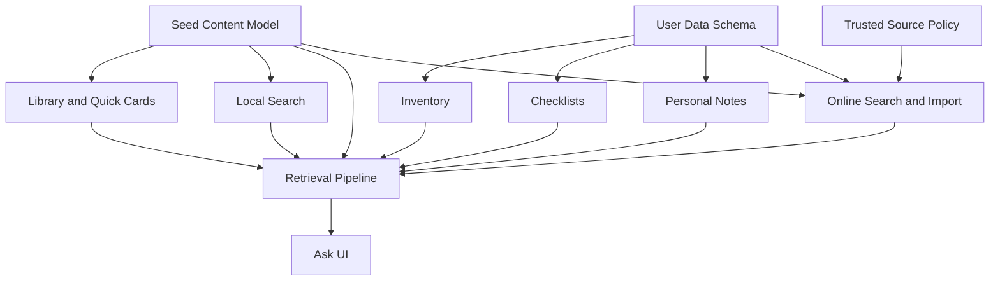

# MVP Scope And Roadmap

Status: Initial draft complete.  
Related docs: [PRD](./02-prd.md), [Information Architecture And UX Flows](./04-information-architecture-and-ux-flows.md), [Technical Architecture](./05-technical-architecture.md), [Quality Strategy](./11-quality-strategy-test-plan-and-acceptance.md), [Risk Register](./risk-register.md)

## Confirmed Facts

- The product must deliver meaningful offline value first.
- The first release must remain practical for a solo developer or very small team.
- Major user-facing features should continue working offline even if optional online enrichment is present.

## Assumptions

- The codebase started from a blank iOS app skeleton; the app shell and navigation are now in place (Milestone 1 Phase 1 complete).
- Seed content authoring and technical implementation will need to progress in parallel.
- v1 can ship without cloud backup, cross-device sync, or advanced mapping.

## Recommendations

- Sequence implementation so the local content model and retrieval path exist before Ask UI polishing.
- Keep online knowledge refresh limited to one narrow, trustworthy flow in MVP.
- Defer features that introduce remote accounts, collaboration, or heavy media complexity.

## Open Questions

- Should the first public release include any background refresh, or only manual import and refresh?
- Is offline map support a post-MVP feature?
- How much checklist and inventory sophistication is actually needed before launch?

## v1 MVP Scope

### Included

- native iPhone app shell
- Home, Library, Ask, Inventory, Checklists, Quick Cards, Personal Notes, Settings
- curated seed handbook chapters in all initial domains
- offline local search across handbook and user data
- offline inventory CRUD
- offline checklist templates and checklist runs
- offline personal notes
- bounded Ask over local approved content and app data
- citations in Ask answers
- model capability fallback behavior
- at least one user-driven trusted-source import flow that stores knowledge locally for future offline use

### Excluded From MVP

- account system
- backup and sync
- collaboration
- offline map engine
- attachment-heavy note taking
- bundled fallback LLM
- broad multi-format ingestion beyond the first supported source formats

## v1.1 Enhancements

- curated developer-shipped remote content packs
- subscribed source refresh for previously approved sources
- richer inventory alerts such as expiring supplies and low-stock reminders
- improved Ask explanation quality and better result grouping
- optional export of notes, inventory, and checklist data
- widgets or app shortcuts for emergency quick cards

## Future Stretch Ideas

- explicit backup and sync
- household shared profiles
- offline map overlays and map note pinning
- richer import pipeline for PDFs or structured public documents
- advanced retrieval methods such as embeddings if justified
- Apple Watch or iPad companions

## What Is Deferred

- any feature that requires a backend to be useful
- advanced geospatial functionality
- generalized chat behavior
- broad media management
- multi-user workflows and permissions

## Implementation Sequencing

1. Project skeleton, navigation shell, and design tokens.
2. Persistence layer, seed-content import, and repository protocols.
3. Handbook and quick-card browsing plus local search.
4. Inventory, checklists, and notes.
5. Retrieval pipeline and Ask with extractive fallback.
6. Foundation Models integration on supported devices.
7. Trusted-source search, import, normalization, and local persistence.
8. Hardening, migration tests, and release preparation.

## Milestone-Based Roadmap

### Milestone 1: Foundation _(Complete)_

- Create app shell, data model scaffolding, seed manifest, and first chapter import.
- Phase 1 complete: app shell, tab navigation, design tokens, and module scaffolding are committed.
- Phase 2 complete: SwiftData schema for the first editorial-content slice, repository protocols, bundled seed content import, and focused repository tests.
- Phase 3 complete: offline-first handbook chapter browsing (Library) and quick-card browsing UI, with chapter detail, section reading, quick-card detail, provenance metadata, and empty/error states.
- Exit criteria met: app cold-starts offline and browses seed content from the local repository layer.

### Milestone 2: Core Organizer

- Inventory, notes, checklists, and local search.
- Exit criteria: all local CRUD features work offline and persist correctly across relaunch.

### Milestone 3: Grounded Ask

- Retrieval pipeline, citation packaging, capability detection, and bounded Ask UI.
- Exit criteria: Ask answers only from local evidence and refuses unsupported prompts.

### Milestone 4: Online Enrichment

- Trusted-source discovery, user approval, import pipeline, local indexing, and offline reuse of imported knowledge.
- Exit criteria: imported source material can be used offline after successful local commit.

### Milestone 5: Hardening And Launch

- migration tests, offline stress tests, safety regression, App Store materials, TestFlight feedback loop.
- Exit criteria: release criteria in [Release Readiness](./12-release-readiness-and-app-store-plan.md) are met.

## Dependency Map

## Done Means

- Scope boundaries are explicit enough to resist feature creep.
- The roadmap orders work to reduce rework risk.
- Each milestone has an exit criterion that can be tested.

## Next-Step Recommendations

1. Turn Milestones 1 and 2 into the first implementation backlog.
2. Freeze one supported source format for the initial import prototype.
3. Avoid starting Ask generation work before retrieval and citations are demonstrably correct.
