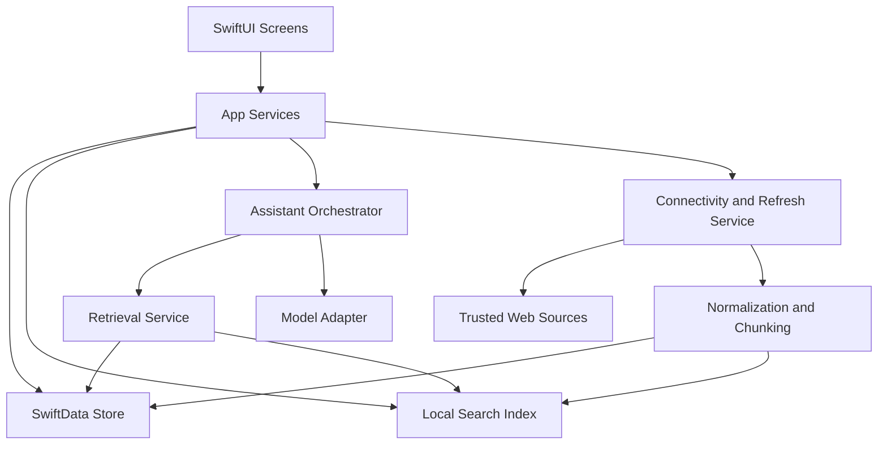
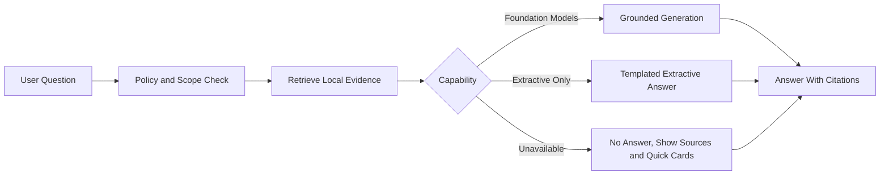

# Technical Architecture

Status: Initial draft complete.  
Related docs: [PRD](./02-prd.md), [Data Model](./06-data-model-local-storage.md), [Sync And Refresh](./07-sync-connectivity-and-web-knowledge-refresh.md), [AI Assistant](./08-ai-assistant-retrieval-and-guardrails.md), [ADR-0001](../adr/ADR-0001-offline-first-local-first.md), [ADR-0002](../adr/ADR-0002-grounded-assistant-only.md), [ADR-0003](../adr/ADR-0003-online-knowledge-refresh-with-local-persistence.md)

## Confirmed Facts

- The product must be offline-first for critical workflows.
- The assistant may answer only from approved local content and app data.
- Optional online capabilities must persist normalized, attributed knowledge locally before it becomes part of the usable offline knowledge base.
- The repository now contains an app shell with tab navigation, explicit `App/Bootstrap` and `App/Navigation` boundaries, a split shared design system, connectivity state modeling, domain-facing repository contracts for editorial content, SwiftData models for handbook chapters, sections, and quick cards, and bundled seed-import wiring for the first offline content slice.
- Milestone 2 user-data domains are implemented: `InventoryRepository`, `ChecklistRepository`, `NoteRepository`, and `SearchService` protocols with SwiftData and SQLite FTS5 implementations. All repositories are injected via SwiftUI `EnvironmentValues`. A sidecar `SearchIndexStore` provides keyword search across all content types using BM25 ranking.
- Milestone 3 is complete: `RetrievalService`, `SensitivityClassifier`, and `CapabilityDetector` protocols in `OSA/Domain/Ask/`; `LocalRetrievalService` in `OSA/Retrieval/Querying/` wrapping FTS5 search with query normalization, sensitivity enforcement, deterministic re-ranking, and citation packaging; `SensitivityPolicy` in `OSA/Assistant/Policy/` for blocked/sensitive topic classification and prompt injection detection; `DeviceCapabilityDetector` and `FoundationModelAdapter` in `OSA/Assistant/ModelAdapters/` for real runtime capability detection and grounded generation; `GroundedPromptBuilder` in `OSA/Assistant/PromptShaping/` for policy-aware prompt construction; and a retrieval-backed Ask UI with answer, citation, and refusal states. The M3 polish sprint wired HomeScreen to live repositories, SettingsScreen to real `DeviceCapabilityDetector` output, AskScreen to `navigationDestination` routing (`QuickCardRouteView`, `HandbookSectionDetailView`), and introduced `AskScopeSettings` in `OSA/Domain/Settings/` as the `@AppStorage`-backed scope control for personal notes in Ask.

## Assumptions

- Initial implementation is a native iPhone app using SwiftUI and modern Apple frameworks.
- The app can target iOS 18 if that materially reduces complexity around Foundation Models; if broader support is required, AI behavior will degrade gracefully.
- The content corpus size for v1 is moderate enough that deterministic indexing and ranking can outperform a more complex embedding-heavy pipeline.

## Recommendations

- Use a layered architecture with clear boundaries between UI, domain services, persistence, retrieval, and network ingestion.
- Use SwiftData for the primary object graph and a separate local search index store for deterministic retrieval.
- Prefer Foundation Models where available, but ship a non-generative extractive fallback rather than bundling a separate large local model in v1.

## Open Questions

- ~~Is iOS 18 an acceptable minimum for first release?~~ **Resolved:** iOS 18.0 is the minimum target. See [ADR-0004](../adr/ADR-0004-ios18-minimum-target-with-foundation-models.md).
- ~~Does the product need offline vector similarity in v1, or is deterministic retrieval enough once the seed corpus is written?~~ **Resolved:** Start with deterministic keyword + metadata ranking; defer embeddings until retrieval gaps emerge.
- ~~Should imported source review be fully user-driven, or can curated background refresh auto-approve some publisher content packs?~~ **Resolved:** Auto-approve curated publisher content packs from Tier 1–2 trusted sources; flag user-added content from unapproved sources for review.

## Architecture Overview

OSA is a local-first iPhone app with four core planes:

1. Presentation: SwiftUI screens optimized for stress-state access and quick offline actions.
2. Local knowledge and user data: handbook content, quick cards, inventory, checklists, notes, citations, and settings persisted on device.
3. Retrieval and assistant services: deterministic content retrieval, guarded answer generation or extractive assembly, and citation rendering.
4. Optional online enrichment: trusted source discovery, import, normalization, attribution, refresh, and local indexing.

## Component Breakdown

### Presentation Layer

- `Home`: emergency-first dashboard, pinned quick cards, offline state, recent activity.
- `Library`: handbook chapter browsing, local search entry, citations into source material.
- `Ask`: grounded local assistant with clear scope boundaries and citations.
- `Inventory`, `Checklists`, `Quick Cards`, `Notes`, `Settings`: first-class product areas.

### Application Services

- `ContentService`: handbook browsing, section expansion, quick card loading.
- `SearchService`: keyword search, tag filters, ranking, index maintenance.
- `AssistantService`: scoped question intake, retrieval, policy checks, answer assembly, citation packaging.
- `InventoryService`, `ChecklistService`, `NotesService`: CRUD and domain logic.
- `ConnectivityService`: `NWPathMonitor` state, task gating, transition handling.
- `RefreshService`: online source search, user review, import, dedupe, stale checks, retry queue.

### Persistence Layer

- SwiftData entities for product state and normalized content.
- Dedicated local search index store, likely SQLite FTS5 in `Application Support/SearchIndex.sqlite`, not coupled directly to SwiftData internals.
- File-backed raw source cache for imported HTML, PDF text extractions, or packaged content snapshots where needed.

## Module Boundaries

Recommended module or target boundaries even if v1 starts in a single app target:

- `App` (conceptually `AppShell`): app lifecycle, dependency container, navigation shell.
- `Features/*`: feature-specific UI and view models.
- `Domain`: models, use cases, repository protocols, policy interfaces.
- `Persistence`: SwiftData models, migrations, repository implementations.
- `Retrieval`: query normalization, ranking. Chunking and Citations subdirs are stubs for future work.
- `Assistant`: prompt policies (`Policy/`), prompt shaping (`PromptShaping/`), model adapters (`ModelAdapters/`). M6P3 `InventoryCompletion/` adds `InventoryCompletionService` for FM-powered structured output inventory suggestions with deterministic heuristic fallback, and `InventoryCompletionMerger` for conservative form-value merging. Orchestration and Formatting subdirs are stubs for future work.
- `Networking`: M4P1 `ConnectivityService` with `NWPathMonitor` implemented in `Clients/`. M4P3 adds `TrustedSourceAllowlist` (15 launch publishers, three trust tiers), `TrustedSourceHTTPClient` protocol, and `URLSessionTrustedSourceHTTPClient` implementation in `Clients/`, plus `TrustedSourceFetchResponse` DTO in `DTOs/`. Import domain models (`SourceRecord`, `ImportedKnowledgeDocument`, `KnowledgeChunk`, `PendingOperation`) implemented in `Domain/ImportedKnowledge/` and `Persistence/SwiftData/`. M4P4 `ImportPipeline/` implements `ImportedKnowledgeNormalizer` (HTML/text normalization, title extraction, content-hash), `KnowledgeChunker` (heading-aware chunking with paragraph fallback, stable local chunk IDs), and `ImportedKnowledgeImportPipeline` (orchestrates normalize → chunk → persist → index with dedupe and version-aware behavior). M4P5 `Refresh/` implements `RefreshRetryPolicy` (deterministic backoff: 5→15→60 minutes, max 3 retries) and `ImportedKnowledgeRefreshCoordinator` (stale-source detection, queue management via `PendingOperation`, connectivity-gated processing, idempotent startup from app bootstrap). M4P6 `Features/Ask/` adds `TrustedSourceImportViewModel` (approved-source filtering, URL validation, preview fetch, import orchestration) and `TrustedSourceImportSheet` (multi-step import flow). `AskScreen` `RefusalView` conditionally offers online import when `insufficientEvidence` + `onlineUsable`. Environment keys for `trustedSourceHTTPClient` and `importPipeline` bridge networking dependencies into SwiftUI.
- `App/Intents/`: M6P1 `AskLanternIntent` (now with `@AssistantIntent(schema: .system.search)` and `StringSearchCriteria`) and `LanternAppShortcutsProvider` for Siri question-answering. M6P2 `Entities/` adds `HandbookSectionEntity`, `QuickCardEntity`, `ChecklistEntity`, and `InventoryItemEntity` (`AppEntity` + `IndexedEntity` + `EntityStringQuery`) backed by `EntityQueryResolver`, which uses the existing FTS5 `SearchService` for ranked candidate search and domain repositories for hydration. M6P4 adds `OpenQuickCardIntent` and `OpenHandbookSectionIntent` for Siri deep-linking via existing entities, plus `OnscreenContentManager` for publishing currently viewed quick card or handbook section context. `SharedRuntime` provides lazy-init `AppDependencies`, `AppNavigationCoordinator`, and `OnscreenContentManager` for non-SwiftUI entry points.
- `App/Navigation/`: M6P4 `AppNavigationCoordinator` mediates tab selection and deep-link route requests from App Intents into the SwiftUI app shell. `AppTabView` observes coordinator state. `AppTab` defines the tab model.
- `Shared`: logging, capability checks, feature flags, utilities.

The boundary matters more than the literal number of Xcode targets; a single target with clean folders and protocols is acceptable for v1.

## Local Knowledge Store Architecture

The app should treat all answerable knowledge as local records:

- Seed handbook content ships in the bundle and is imported into the local store on first launch.
- User-authored data such as notes, inventory, and checklist runs live only in the local store.
- Imported web knowledge is persisted as `SourceRecord`, `ImportedKnowledgeDocument`, and `KnowledgeChunk` records before it can be surfaced by retrieval or cited by the assistant.
- Quick cards are separate first-class records optimized for fast opening and large-type display.

This keeps browsing, search, and Ask operating against one normalized on-device corpus.

## Search And Retrieval Pipeline

Recommendation for v1:

1. Normalize user query.
2. Apply scope filter based on user intent and safety policy.
3. Search local index using keyword, title, tag, and metadata ranking.
4. Pull candidate chunks from handbook sections, quick cards, imported knowledge, checklists, notes, and inventory.
5. Re-rank with deterministic heuristics:
   - exact heading and tag match
   - recent user note relevance
   - content trust level
   - quick card priority for urgent topics
6. Package top results with local record identifiers and citation metadata.
7. Pass retrieved evidence to the assistant layer or direct search UI.

### Chunking And Indexing Approach

Recommendation:

- Handbook sections: chunk by semantic subsection, roughly 150 to 400 words with stable headings.
- Quick cards: store as atomic chunks per card section so they can be cited precisely.
- Imported knowledge: chunk after normalization by heading and paragraph group, preserving source attribution and content hash.
- Notes and inventory: index whole record plus key structured fields.

Stable local chunk IDs must survive refresh where content hash and semantic boundaries are unchanged.

## Inference And Model Abstraction Layer

Use a model adapter with capability-based branching:

- `foundationGeneration`: Apple Foundation Models available and permitted.
- `extractiveOnly`: no supported on-device generation, but retrieval and deterministic templated answer assembly available.
- `unavailable`: Ask still returns search results and quick card suggestions with no generated prose.

### Foundation Models Vs Bundled Local Model Fallback

Option A, recommended for v1:

- Use Foundation Models on supported devices.
- Fall back to extractive answer assembly when unavailable.
- Pros: lower app size, lower operational complexity, better alignment with Apple platform capabilities, easier single-developer maintenance.
- Cons: answer quality varies by hardware and OS; some devices will not get fluent generated summaries.

Option B, not recommended for v1:

- Bundle or side-load a compact local model fallback.
- Pros: more uniform behavior across devices.
- Cons: large app size, memory pressure, battery cost, longer startup, more safety evaluation burden, more complex update path.

## Sync And Update Architecture

The app should treat online behavior as enrichment, not dependency:

- Connectivity detection via `NWPathMonitor`.
- User-initiated source search and import as the primary v1 flow.
- Background refresh limited to lightweight stale-source checks and subscribed content pack updates.
- Retry queue persisted locally so interrupted refreshes can resume or retry without data loss.
- No user-account sync in v1; future sync is a separate architecture track.

## Content Ingestion Pipeline

Recommended flow:

1. Discover candidate trusted sources.
2. Capture source metadata and download content into a raw cache.
3. Normalize to project content schema.
4. Run trust and policy filters.
5. Chunk content into citeable local records.
6. Persist `SourceRecord`, `ImportedKnowledgeDocument`, `KnowledgeChunk`, and citation metadata.
7. Index chunks locally.
8. Mark content available for offline retrieval.

## Trust Boundaries

- Trusted local content boundary: bundled handbook, reviewed quick cards, user-authored notes and inventory, and approved imported knowledge already persisted locally.
- Untrusted input boundary: live web pages, user prompts, pasted notes, and partially downloaded remote content.
- Model boundary: the model may summarize only retrieved approved evidence; it must not invent unsupported facts or reach out directly to the web.
- Logging boundary: prompts, notes, inventory, and retrieved content should not leave the device by default.

## Recommended Tech Choices With Tradeoffs

### SwiftData Vs Core Data

Recommendation: SwiftData for v1, with repository protocols and migration discipline that keep a future Core Data switch possible.

- SwiftData pros: faster setup, modern Swift ergonomics, lower solo-developer friction, good fit for a greenfield iOS app.
- SwiftData cons: fewer mature tooling patterns, less proven for very complex migrations, less direct control in edge cases.
- Core Data pros: battle-tested, mature migration tools, deeper performance tuning options.
- Core Data cons: more boilerplate, higher cognitive load, slower early iteration.

Fallback trigger: if migration reliability or query performance becomes a blocker during prototype validation, reassess Core Data before public release.

### Embeddings Vs Keyword And Metadata Search

Recommendation: start without embeddings in v1.

- Deterministic keyword plus metadata search is simpler to test, explain, and safety-audit.
- The initial corpus is curated and not massive; careful taxonomy and chunking should be sufficient.
- Revisit embeddings after real evaluation data shows retrieval gaps that lexical ranking cannot close.

### Background Refresh Model

Recommendation:

- Use `BGAppRefreshTask` for stale checks and metadata refresh.
- Use background `URLSession` only for larger content pack downloads or approved source refreshes.
- Require imported content to complete normalization and local commit atomically before it becomes queryable.

## CI And Quality Automation

- **GitHub Actions CI** (`.github/workflows/ci.yml`): build, test, and Codecov coverage upload on push/PR to `main`.
- **GitHub Actions CodeQL** (`.github/workflows/codeql.yml`): weekly and push/PR Swift security analysis.
- **Codacy**: code quality analysis with local CLI (`.codacy/cli.sh`) and grade badge.
- **Codecov**: code coverage tracking with PR diffs and coverage badge.

## Done Means

- Architecture boundaries are clear enough to scaffold the project.
- The local-first knowledge path is defined from seed content through Ask and online import.
- The fallback behavior for missing on-device generation support is explicit.
- The document provides concrete decision points for persistence, retrieval, and refresh implementation.

## Next-Step Recommendations

1. ~~Confirm minimum iOS target and supported device matrix.~~ **Resolved:** iOS 18.0. See [ADR-0004](../adr/ADR-0004-ios18-minimum-target-with-foundation-models.md).
2. ~~Prototype SwiftData plus a sidecar search index before writing feature UI.~~ **Done:** SwiftData schema and repository protocols are implemented for all content types. A sidecar SQLite FTS5 search index (`SearchIndexStore` in `OSA/Persistence/SearchIndex/`) provides BM25-ranked keyword search across handbook sections, quick cards, inventory, checklists, and notes. `LocalSearchService` wires indexing and query. Library search results UI is connected.
3. ~~Build the repository and service protocols before any feature-specific persistence code.~~ **Done:** `HandbookRepository`, `QuickCardRepository`, `SeedContentRepository`, `InventoryRepository`, `ChecklistRepository`, `NoteRepository`, and `SearchService` protocols are defined with corresponding SwiftData and SQLite implementations. All repositories are injected via SwiftUI `EnvironmentValues`.
