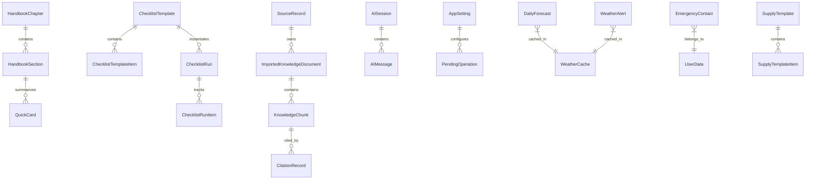

# Data Model And Local Storage

Status: Initial draft complete.  
Related docs: [Technical Architecture](./05-technical-architecture.md), [Sync And Refresh](./07-sync-connectivity-and-web-knowledge-refresh.md), [AI Assistant](./08-ai-assistant-retrieval-and-guardrails.md), [Content Guidelines](./09-content-model-editorial-guidelines.md), [Security And Privacy](./10-security-privacy-and-safety.md)

## Confirmed Facts

- Core functionality must work fully offline from locally stored content and user data.
- Imported web knowledge must become locally available for future offline use.
- The product requires local handbook content, quick cards, checklists, inventory, notes, citations, bounded Ask-session context, and settings.
- The first editorial-content persistence slice is now implemented: SwiftData models for `PersistedHandbookChapter`, `PersistedHandbookSection`, `PersistedQuickCard`, and `PersistedSeedContentState`; domain-facing value types and repository protocols (`HandbookRepository`, `QuickCardRepository`, `SeedContentRepository`); a `SwiftDataContentRepository` implementation; a versioned seed-manifest loader and importer; and focused repository-contract tests.
- User-data persistence is now implemented: `PersistedInventoryItem`, `PersistedChecklistTemplate`, `PersistedChecklistTemplateItem`, `PersistedChecklistRun`, `PersistedChecklistRunItem`, and `PersistedNoteRecord` SwiftData models with record mappings; `SwiftDataInventoryRepository`, `SwiftDataChecklistRepository`, and `SwiftDataNoteRepository` implementations; and repository-contract tests for each domain.
- A sidecar SQLite FTS5 search index (`SearchIndexStore`) is implemented in `OSA/Persistence/SearchIndex/` with BM25 ranking, porter-stemmed tokenization, and prefix search. `LocalSearchService` wires index maintenance and query across all five content types. `SearchIndexRebuilder` repopulates the index from repository truth at bootstrap, and note or inventory writes update the index incrementally through repository decorators.
- Imported knowledge persistence is now implemented: `PersistedSourceRecord`, `PersistedImportedKnowledgeDocument`, `PersistedKnowledgeChunk`, and `PersistedPendingOperation` SwiftData models with cascade relationships; domain value types and enums (`TrustLevel`, `ReviewStatus`, `DocumentType`, `OperationType`, `OperationStatus`); `ImportedKnowledgeRepository` and `PendingOperationRepository` protocols with SwiftData implementations; repository-contract tests for both repositories. M4P4 adds `ImportedKnowledgeNormalizer` (HTML/text → `NormalizedDocument` with title, content-hash, publisher domain), `KnowledgeChunker` (heading-aware chunking with paragraph fallback), and `ImportedKnowledgeImportPipeline` (orchestrates normalize → chunk → persist to repository → extend FTS5 index with dedupe and document versioning). `SearchService.indexImportedChunk` extends the FTS5 index for imported knowledge chunks.

## Assumptions

- SwiftData will be the primary persistence mechanism for v1.
- Search indexing will use a separate sidecar store rather than relying only on SwiftData queries.
- Seed content will be shipped as versioned bundled data and imported into the local store on first launch.

## Recommendations

- Keep structured records in SwiftData and raw imported artifacts in `Application Support`.
- Use stable UUIDs and content hashes to support deduplication, refresh, and citation durability.
- Separate editorial content identity from user state so handbook updates do not corrupt notes, checklist history, or citations.

## Open Questions

- Should attachments such as photos or scanned documents be in scope for inventory or notes in v1?
- Should local map assets be records in the same store or a future file-backed feature?
- Is user export needed before any migration strategy is considered production-ready?

## Storage Strategy

### Primary Store

- SwiftData for normalized entities and relationships.
- One persistent store for user data and local knowledge.
- Repository layer hides direct framework calls from feature code.

### Sidecar Stores

- `SearchIndex.sqlite`: keyword and metadata index.
- `RawSources/`: downloaded HTML, text extracts, source snapshots, or parser intermediates.
- `SeedContent/`: bundled JSON or Markdown content packs with version manifests.

### Data Classes

- Immutable or slowly changing editorial content: chapters, sections, quick cards, checklist templates.
- Mutable user state: notes, inventory items, checklist runs, settings, AI sessions.
- Imported knowledge: source metadata, normalized documents, chunks, citations, refresh state.

## Core Entities



## Entity Schemas

### HandbookChapter

- `id`: UUID
- `slug`: stable string
- `title`
- `summary`
- `sortOrder`
- `tags`
- `version`
- `isSeeded`
- `lastReviewedAt`

### HandbookSection

- `id`
- `chapterID`
- `parentSectionID` optional
- `heading`
- `bodyMarkdown`
- `plainText`
- `sortOrder`
- `tags`
- `safetyLevel` such as normal, sensitive-static-only
- `chunkGroupID`
- `version`
- `lastReviewedAt`

### QuickCard

- `id`
- `title`
- `slug`
- `category`
- `summary`
- `bodyMarkdown`
- `priority` for emergency surfacing
- `relatedSectionIDs`
- `tags`
- `lastReviewedAt`
- `largeTypeLayoutVersion`

### InventoryItem

- `id`
- `name`
- `category`
- `quantity`
- `unit`
- `location`
- `notes`
- `expiryDate` optional
- `reorderThreshold` optional
- `tags`
- `createdAt`
- `updatedAt`
- `isArchived`

### ChecklistTemplate

- `id`
- `title`
- `slug`
- `category`
- `description`
- `estimatedMinutes`
- `tags`
- `sourceType` such as seeded or imported-reviewed
- `lastReviewedAt`

### ChecklistTemplateItem

- `id`
- `templateID`
- `text`
- `detail`
- `sortOrder`
- `isOptional`
- `riskLevel`

### ChecklistRun

- `id`
- `templateID` optional for ad hoc lists
- `title`
- `startedAt`
- `completedAt` optional
- `status`
- `contextNote`

### ChecklistRunItem

- `id`
- `runID`
- `templateItemID` optional
- `text`
- `isComplete`
- `completedAt` optional
- `sortOrder`

### NoteRecord

- `id`
- `title`
- `bodyMarkdown`
- `plainText`
- `noteType` such as personal, local-reference, family-plan
- `tags`
- `linkedSectionIDs`
- `linkedInventoryItemIDs`
- `createdAt`
- `updatedAt`

Sprint 6 study guides reuse `NoteRecord` with `noteType = .localReference`, tag `study-guide`, and `linkedSectionIDs` derived from grounded citations.

### SourceRecord

Required metadata for imported knowledge:

- `id`
- `sourceTitle`
- `sourceURL`
- `publisherDomain`
- `publisherName`
- `fetchedAt`
- `lastReviewedAt`
- `contentHash`
- `trustLevel`
- `tags`
- `localChunkIDs`
- `reviewStatus`
- `licenseSummary` optional
- `isActive`
- `staleAfter`

### ImportedKnowledgeDocument

- `id`
- `sourceID`
- `title`
- `normalizedMarkdown`
- `plainText`
- `documentType`
- `versionHash`
- `importedAt`
- `supersedesDocumentID` optional

### KnowledgeChunk

- `id`
- `documentID`
- `localChunkID`
- `headingPath`
- `plainText`
- `sortOrder`
- `tokenEstimate`
- `tags`
- `trustLevel`
- `contentHash`
- `isSearchable`

### CitationRecord

- `id`
- `chunkID` optional
- `sectionID` optional
- `quickCardID` optional
- `displayLabel`
- `anchorText`
- `sourceTitle`
- `sourceURL` optional for imported sources
- `publisherDomain` optional
- `generatedAt`

### AISession _(deferred beyond M3)_

- `id`
- `startedAt`
- `endedAt` optional
- `capabilityMode` such as foundationGeneration or extractiveOnly
- `scope` such as handbook-only or handbook-plus-user-data
- `lastAnswerStatus`

The current implementation does not persist conversation history. Session and message models are deferred to a future milestone. Ask follow-up uses transient `RetrievalContext` and `FollowUpContext` value types in memory only.

### AIMessage _(deferred beyond M3)_

- `id`
- `sessionID`
- `role`
- `text`
- `citationIDs`
- `createdAt`
- `blockedReason` optional

### AskScopeSettings _(live — M3 Polish)_

Lightweight settings layer using `@AppStorage` (not SwiftData). Lives in `OSA/Domain/Settings/AskScopeSettings.swift`.

- `includePersonalNotes`: Bool, default `false`, key `settings.ask.includePersonalNotes`
- Controls the `RetrievalScope` set passed to the retrieval pipeline
- Surfaced as a toggle in both AskScreen and SettingsScreen

### PinnedContentSettings _(Sprint 2 — Live)_

Lightweight settings for pinned Quick Cards and Handbook Sections using `@AppStorage` (not SwiftData). Lives in `OSA/Domain/Settings/PinnedContentSettings.swift`.

- `pinnedQuickCardIDsKey`: encoded UUID array for pinned quick cards
- `pinnedSectionIDsKey`: encoded UUID array for pinned handbook sections
- Surfaced via toolbar buttons and context menus in QuickCardsScreen, QuickCardDetailView, HandbookSectionDetailView

### RecentLibraryHistorySettings _(Sprint 2 — Live)_

Lightweight settings for recently viewed Handbook Sections using `@AppStorage` (not SwiftData). Nested enum in `OSA/Domain/Settings/PinnedContentSettings.swift`.

- `recentSectionIDsKey`: ordered list of last 6 viewed section IDs
- `recorded(_:rawValue:limit:)`: inserts newest-first, deduplicates, caps at limit
- `prune(rawValue:keeping:)`: removes stale IDs when sections are deleted
- Surfaced as "Recently Viewed" section in LibraryScreen

### RecentAskHistorySettings _(Sprint 6 — Live)_

Lightweight settings for recent Ask questions using `@AppStorage` (not SwiftData). Lives in `OSA/Domain/Settings/RecentAskHistorySettings.swift`.

- `recentQuestionsKey`: encoded ordered list of recent question strings
- `recorded(_:rawValue:limit:)`: inserts newest-first, deduplicates, caps at limit
- `prune(rawValue:keeping:)`: removes invalid or stale values while preserving order
- Used by AskScreen and Home contextual suggestions
- Stores question strings only. Full answers, transcripts, and multi-turn message objects are not persisted

### AppSetting _(deferred to M4 — Online Enrichment)_

The more general SwiftData-backed settings entity remains deferred. `AskScopeSettings` above covers the one live setting using `@AppStorage`.

- `id`
- `key`
- `valueType`
- `stringValue` optional
- `boolValue` optional
- `numberValue` optional
- `updatedAt`

### PendingOperation _(M4P2 — Complete)_

- `id`
- `operationType`
- `status`
- `payloadReference`
- `createdAt`
- `updatedAt`
- `retryCount`
- `lastError`

### EmergencyContact _(Emergency — Complete)_

- `id`: UUID
- `name`: String
- `phone`: String
- `email`: String?
- `relationship`: String
- `notes`: String?
- `isPrimary`: Bool
- `createdAt`: Date
- `updatedAt`: Date

Persisted via `PersistedEmergencyContact` SwiftData model. CRUD UI in `EmergencyContactFormView`. Repository: `EmergencyContactRepository` protocol with `SwiftDataEmergencyContactRepository` implementation.

### SupplyTemplate _(Inventory — Complete)_

Bundled hazard-scenario supply kits (e.g., earthquake, wildfire, flood). Loaded from `supply-templates-core-v1.json` via `BundledSupplyTemplateRepository`. Not persisted in SwiftData — read-only bundled content. Repository: `SupplyTemplateRepository` protocol.

### DailyForecast _(Weather — Complete)_

- `id`: UUID
- `date`: Date
- `highTemperature`: Double (Celsius)
- `lowTemperature`: Double (Celsius)
- `conditionCode`: String (WeatherKit condition raw value)
- `conditionDescription`: String
- `precipitationChance`: Double (0.0–1.0)
- `uvIndexValue`: Int
- `windSpeedKmh`: Double
- `symbolName`: String (SF Symbol name)
- `fetchedAt`: Date

Persisted via `PersistedDailyForecast` SwiftData model. Entire forecast cache is replaced on each refresh. Staleness threshold: 1 hour.

### WeatherAlert _(Weather — Complete)_

- `id`: UUID
- `title`: String
- `summary`: String
- `alertURL`: URL
- `severity`: WeatherAlertSeverity (extreme, severe, moderate, minor, unknown)
- `areaDescription`: String
- `effectiveDate`: Date?
- `expiresDate`: Date?
- `sourceHost`: String
- `fetchedAt`: Date

Persisted via `PersistedWeatherAlert` SwiftData model. Active alerts filtered by `expiresDate > now`. Surfaced in both the Weather screen and the Home feed via `HomeFeedItem` union type.

## Local File And Storage Layout

Recommended layout under app container:

```text
Application Support/
  OSA.sqlite
  SearchIndex.sqlite
  SeedManifest.json
  RawSources/
    <source-id>/
      original.html
      extracted.txt
      metadata.json
  ContentPacks/
    handbook-v1.json
    quickcards-v1.json
  Imports/
    <document-id>.json
Caches/
  RefreshTemp/
  RenderedSearchSnippets/
```

## Migration Strategy

- Use explicit schema versioning for seed content and data model.
- Migrate editorial content by comparing stable slugs, content hashes, and version numbers.
- Keep user-authored records separate from seeded records so seeded updates do not overwrite user edits.
- Run migration checks on cold start after app updates and before background refresh jobs mark new content active.
- Keep a rollback-safe backup of the last known-good store before any destructive schema migration during development and beta.

## Backup And Restore Considerations

- Default stance for v1: rely on iOS device backup behavior, but do not promise cross-device restore semantics yet.
- Keep raw imported artifacts reproducible from normalized stored records where possible to reduce storage footprint.
- Future explicit export should include user notes, inventory, checklist runs, and settings, but not necessarily bundled seed content.
- If iCloud backup opt-out is needed for sensitive content, it must be a deliberate later decision with user communication.

## Seed Data Strategy

- Author handbook chapters, sections, quick cards, and checklist templates as versioned source files in the repo once content drafting begins.
- Import seed content on first launch into normalized records with stable IDs.
- Maintain a seed manifest with content pack version, record counts, content hashes, and review timestamps.
- Treat seed updates as migrations rather than ad hoc inserts.

## Done Means

- The entities cover all required core features and online knowledge refresh needs.
- Required imported-source metadata is explicitly defined.
- Local file layout and migration strategy are concrete enough to implement without inventing new structure.
- The schema keeps citations durable across refresh and reindexing events.

## Next-Step Recommendations

1. ~~Convert this model into SwiftData schemas and repository protocols before feature UI.~~ **Done:** All core entity schemas are implemented — editorial content (chapters, sections, quick cards) and user data (inventory, checklists, notes) — with SwiftData models, domain value types, repository protocols, and environment-key DI. Feature UI layers read from these models through protocol injection.
2. ~~Create versioned seed content manifests alongside the future Xcode project.~~ **Done:** `SeedManifest.json` with content-pack versioning, record counts, and content hashes is in `OSA/Resources/SeedContent/`, extended to include checklist template seed data.
3. Decide whether attachments and map assets belong in v1 before freezing the first schema version.
