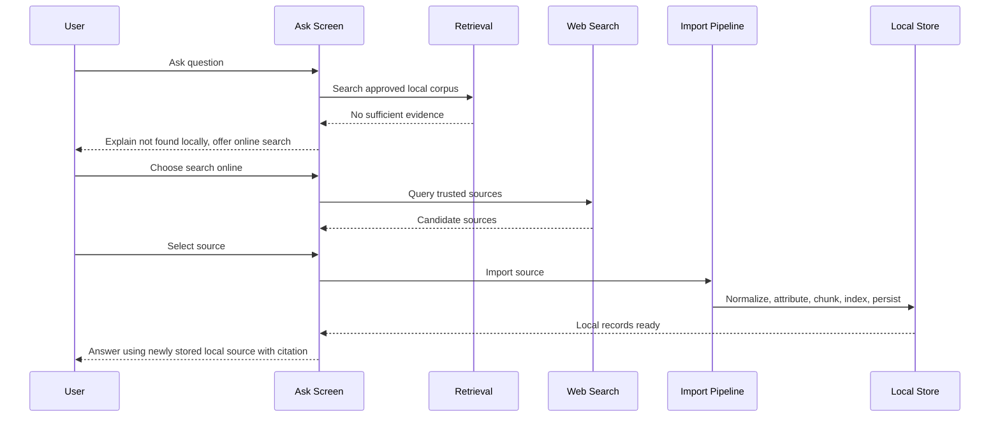

# Sync, Connectivity, And Web Knowledge Refresh

Status: Initial draft complete.  
Related docs: [Technical Architecture](./05-technical-architecture.md), [Data Model](./06-data-model-local-storage.md), [AI Assistant](./08-ai-assistant-retrieval-and-guardrails.md), [Security And Privacy](./10-security-privacy-and-safety.md), [ADR-0001](../adr/ADR-0001-offline-first-local-first.md), [ADR-0003](../adr/ADR-0003-online-knowledge-refresh-with-local-persistence.md)

## Confirmed Facts

- Core product functionality must continue to work offline.
- Online capabilities are optional enrichments, not dependencies for core flows.
- Imported or refreshed knowledge must become locally available for future offline use.

## Assumptions

- v1 will not support cross-device sync of user notes, inventory, or checklist state.
- Online behavior will focus on trusted source discovery, import, review, and refresh.
- Connectivity may be intermittent and can change mid-task.

## Recommendations

- Design all online actions as resumable, queued operations with explicit local states.
- Separate source discovery from source approval and from local commit.
- Do not let partially fetched or unreviewed remote content enter the assistant retrieval corpus.

## Open Questions

- Should any trusted source families be auto-refreshable without per-item user approval?
- How aggressive should background stale checks be on battery-constrained devices?
- Does v1 need remote content packs managed by the developer in addition to user-selected imports?

## Offline-First Principles

1. The app must remain fully usable for handbook browsing, local search, Ask over local data, quick cards, inventory, checklists, and notes with no network.
2. The current connectivity state must inform UX but must never block local reads or edits.
3. Remote content only becomes answerable content after local persistence, indexing, and approval.
4. Online refresh failures must not corrupt the existing local knowledge base.

## Connectivity Detection Strategy

- Use `NWPathMonitor` for coarse network reachability and interface changes.
- Track app-level connectivity states:
  - `offline`
  - `onlineConstrained`
  - `onlineUsable`
  - `syncInProgress`
- Combine reachability with lightweight request validation before expensive imports.
- Surface a clear offline badge and last successful refresh timestamp in relevant screens.

## Queueing And Retry Behavior

Persist all remote work as `PendingOperation` records:

- `discoverSources`
- `downloadSource`
- `normalizeSource`
- `reviewSource`
- `indexImportedContent`
- `refreshKnownSource`

Retry policy recommendation:

- immediate retry for transient parsing failures caused by partial download
- exponential backoff for network failures
- manual user intervention for trust-policy rejection or content-format errors
- hard stop after a bounded retry count with a visible error state

## Mid-Task Connectivity Changes

### If The App Goes Offline Mid-Task

- Active downloads pause or fail into resumable state.
- Already committed local content remains usable.
- The assistant continues to answer from the last known local corpus.
- The UI should explain that online import is paused, not lost.

### If The App Comes Online Mid-Task

- Pending tasks resume only if user intent and trust state are still valid.
- Background stale checks may resume, but should not preempt explicit user actions.
- Any import must still complete normalization and local commit before surfacing in search or Ask.

## Trusted Web Source Policy

Launch recommendation:

- Maintain an allowlist of trusted domains and publisher profiles.
- Classify each source by trust tier:
  - `tier1-reviewed`: developer-curated authoritative sources
  - `tier2-user-approved`: trusted source imported after user approval
  - `tier3-local-note`: user-authored notes, never treated as authoritative external reference
- Reject unknown domains by default in v1 unless the user explicitly imports text into notes outside the assistant corpus.

Policy criteria:

- relevance to preparedness and safety basics
- stable publishing identity
- clear publication or review date
- lawful, non-tactical, non-harm-seeking content
- source format parsable into citeable local chunks

## User Approval Model For Importing Knowledge

Recommended v1 behavior:

1. User asks a question not answerable locally.
2. App states that local content is insufficient.
3. If connected, app offers trusted online search.
4. App presents candidate sources with domain, title, summary, and trust tier.
5. User selects a source to import or review.
6. App imports, normalizes, attributes, chunks, indexes, and persists locally.
7. Imported knowledge is then available for future offline answers.

This keeps the user in control of what becomes part of the on-device knowledge base.

## Storage Of Imported Knowledge Locally

Imported material must be stored as normalized local records:

- `SourceRecord` for provenance and trust metadata
- `ImportedKnowledgeDocument` for normalized document text
- `KnowledgeChunk` for citeable retrieval units
- raw source artifact cache where needed for later re-parse or audit

The assistant may cite only these stored local records, not the live remote page.

## Deduplication And Versioning

- Use normalized content hash plus canonical source URL to detect duplicates.
- If fetched content changes materially, create a new document version and mark the previous version superseded but retained for audit and citation history.
- Maintain stable source identity across refreshes even when documents version.
- Do not create duplicate chunks when content hash and chunk boundaries are unchanged.

## Stale-Content Rules

- Every imported source gets `fetchedAt`, `lastReviewedAt`, and `staleAfter`.
- Seed handbook and quick cards use editorial review dates rather than web freshness.
- Assistant answers should prefer less stale content when relevance is comparable.
- If only stale content exists, the assistant should still answer from it but label it as potentially outdated when appropriate.
- High-sensitivity content categories such as first aid and medications should use shorter stale windows and stricter review requirements.

## Sync Conflict Rules

v1 conflict scope is narrow because there is no cross-device user-data sync:

- Local user edits always win for notes, inventory, and checklist runs because there is no remote canonical source.
- Imported source refreshes never overwrite user-authored notes.
- Seed content updates may supersede seed records, but only by versioned migration logic.
- If refreshed external content conflicts with previously imported content, keep both versions and update active ranking rather than destructive replacement.

## Background Refresh Behavior

Recommendation:

- Allow background stale checks for approved sources and developer-shipped content packs.
- Download larger updates with background `URLSession`.
- Commit refreshed content atomically only after normalization, validation, and indexing complete.
- Respect battery, Low Power Mode, and constrained network status.
- Log background failures locally for later diagnostics without leaking content off-device.

## Telemetry And Logging Boundaries

Default boundary:

- no prompt text upload
- no note, inventory, or checklist content upload
- no retrieved evidence upload
- local-only diagnostic logs unless a future explicit opt-in support export is added

Acceptable minimal metrics if added later:

- refresh success or failure counts
- source freshness counts
- model capability availability counts

Those metrics should remain on device unless the user explicitly opts in to send diagnostics.

## Required Online Flows

### Flow 1: Question Not Answerable Locally

### Flow 2: Background Refresh Of Approved Source

1. Background job checks staleness metadata.
2. If network and policy allow, fetch source metadata or updated content.
3. Normalize and compare content hash.
4. If unchanged, update refresh metadata only.
5. If changed, create new local version, reindex, and mark it active.
6. Future offline answers cite the new locally stored version.

## Done Means

- The app can move cleanly between offline and online states without breaking core flows.
- Imported knowledge is persisted, attributed, and usable offline before Ask can cite it.
- Retry, stale-content, and refresh rules are explicit enough for implementation and QA.
- Privacy boundaries around logging and remote operations are clearly constrained.

## Next-Step Recommendations

1. ~~Define the first trusted-source allowlist and trust tiers.~~ **Resolved:** Three-tier allowlist defined with 15 PNW-focused survival and preparedness sources. Tier 1–2 auto-approve; Tier 3 and user-added flagged for review.
2. Add `PendingOperation` and source freshness fields to the first persistence schema.
3. Prototype the import pipeline with one text-based source before supporting more complex formats.
